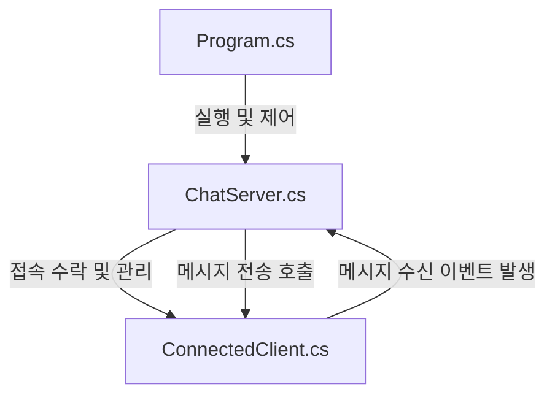

https://github.com/IndieGameMaker/TCPChatServer2026

비동기 TCP 멀티 채팅 서버

TCP 프로토콜을 사용해 다중 클라이언트의 접속을 수락하고 메시지를 실시간으로 브로드캐스팅하는 C# 채팅 서버의 코드 구조 정리.

---

1. 전체 코드 구조

역할에 따라 3개의 클래스로 분리되어 있음.

---

2. 클래스별 기능 분석

- Program.cs (서버 실행부)
  - UTF-8 인코딩 설정 및 포트 번호(7777) 설정
  - ChatServer 인스턴스를 생성하고 시작/종료 처리
  - Console.ReadKey(true)로 대기하다가 키 입력 시 서버를 정상 종료하도록 흐름 제어

- ConnectedClient.cs (클라이언트 세션 관리)
  - 접속한 개별 클라이언트 소켓(TcpClient)과 스트림 관리 담당
  - 생성자에서 StreamReader와 StreamWriter를 UTF-8 인코딩으로 설정
  - ReceiveMessageAsync()
    - ReadLineAsync()를 사용해 클라이언트가 보낸 메시지를 비동기적으로 한 줄씩 읽음
    - 읽은 메시지가 null이면 연결 종료로 판단하고 루프 탈출
    - 정상 메시지 수신 시 MessageReceived 이벤트를 트리거하여 서버에 알림
  - SendMessageAsync()
    - 특정 클라이언트에게 비동기적으로 메시지를 전송 (WriteLineAsync)
  - Dispose()
    - 통신이 끝나면 열려 있는 소켓 및 스트림 리소스를 해제

- ChatServer.cs (서버 리스너 및 브로드캐스트)
  - TcpListener를 통해 클라이언트 접속 요청을 대기 및 수락
  - ConcurrentDictionary<string, ConnectedClient>를 사용하여 다중 스레드 환경에서 클라이언트 목록을 안전하게 추가/삭제
  - AcceptClientAsync()
    - 클라이언트 접속 시 ConnectedClient 인스턴스를 생성해 목록에 등록
    - 클라이언트의 MessageReceived 이벤트를 구독하고, ReceiveMessageAsync 태스크를 비동기로 구동
  - OnMessageReceived()
    - 클라이언트가 메시지를 보내 이벤트가 발생하면 작동하는 콜백 메서드
    - 발신자 정보를 포함해 메시지 포맷팅 후 BroadcastMessageAsync 호출
  - BroadcastMessageAsync()
    - 목록에 있는 모든 클라이언트를 순회하며 메시지를 비동기로 전송

---

3. 핵심 개념 정리

- 비동기 프로그래밍 (async / await)
  - I/O 블로킹을 방지하기 위해 스트림 읽기/쓰기 및 클라이언트 접속 수락에 비동기 메서드를 사용함
- 이벤트 기반 통신 (Event-Driven)
  - 클라이언트와 서버 간의 결합도를 낮추기 위해 C# event Action 구조를 활용. 클라이언트는 메시지 수신 시 이벤트를 발생시키고, 서버가 이를 감지하여 처리하는 방식
- 스레드 안전성 (Thread-Safety)
  - 여러 클라이언트가 동시에 접속/종료/메시지 송신을 시도하므로 동시성 컬렉션인 ConcurrentDictionary를 사용해 충돌 방지
- 자원 해제 (Dispose)
  - 소켓 및 스트림의 누수를 막기 위해 IDisposable 인터페이스를 구현하고 명시적으로 자원을 해제함
